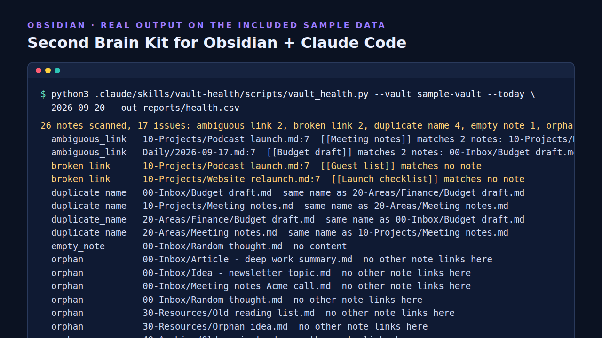

# Obsidian vault health check (Claude Code skill + standalone script)




A read-only audit for an [Obsidian](https://obsidian.md) vault: **broken and ambiguous wikilinks, orphan notes, duplicate note names, missing properties, empty notes and stale notes.**
Pure Python (standard library), tested, and it never modifies a note. Use it standalone or as a [Claude Code](https://claude.com/claude-code) skill that explains the findings and drafts fixes for you to approve.

## Try it (2 minutes)
```
git clone https://github.com/Hanru269/obsidian-vault-health-check && cd obsidian-vault-health-check
python3 .claude/skills/vault-health/scripts/vault_health.py --vault sample-vault --require type --today 2026-09-20
python3 -m unittest discover -s tests
```
On the fictional sample vault: 26 notes, 22 issues: 2 broken links, 2 ambiguous links, 4 duplicate-name notes, 5 missing `type`, 7 orphans, 1 empty note, 1 stale note. Reported line numbers are real file line numbers (frontmatter included).

## Use it on your vault
Back it up, then: `python3 .claude/skills/vault-health/scripts/vault_health.py --vault ~/YourVault --require type,created --ignore-folders Daily,Templates`.
Or copy `.claude/` and `CLAUDE.md` into your vault, open Claude Code there and ask *"audit my vault"*.

## What counts as what
- **Broken link**: `[[Target]]` (also `[[Target|alias]]`, `[[Target#Heading]]`, note `aliases:`) matches no note. Images/embeds and links in code are ignored.
- **Ambiguous link**: the name matches two or more notes (Obsidian may open the wrong one).
- **Orphan**: no other note links to it. Normal for inbox and reference notes, so `Daily` and `Templates` are exempt by default.
- **Stale**: not modified for N days (default 180) and not in an Archive folder. Uses a `modified:`/`updated:` property when present, else the file's modified time.

## Limits
Simple frontmatter parsing (not full YAML); plugin-specific syntax is not interpreted; works on plain-markdown vaults on disk.

## More
This is one of six skills in the **Second Brain Kit for Obsidian + Claude Code**: task roll-up, inbox triage with dry-run and undo, weekly-review facts, link suggestions and daily notes with carried-over tasks. [https://croucamp.gumroad.com/l/obsidian-second-brain-kit](https://croucamp.gumroad.com/l/obsidian-second-brain-kit)

MIT licensed.
